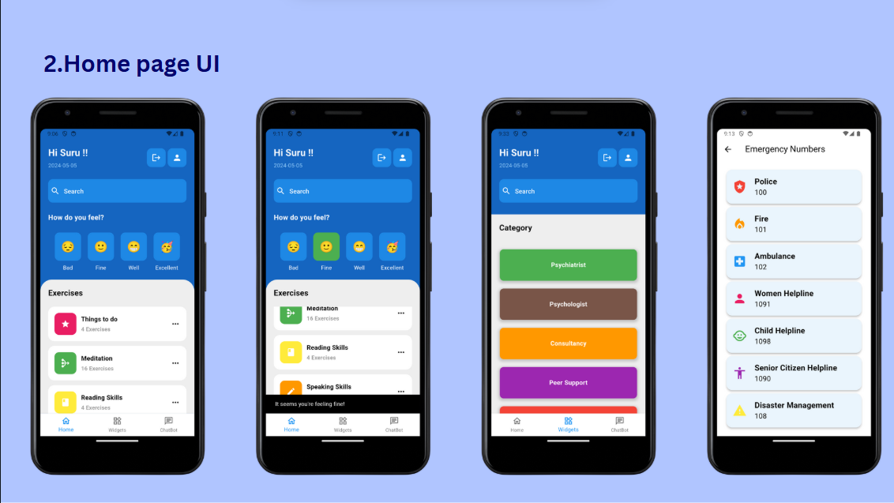
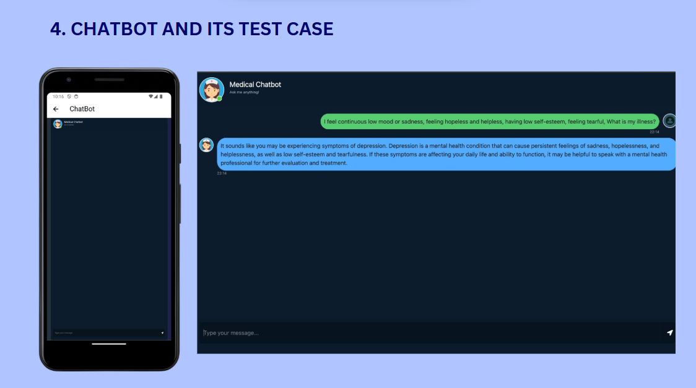
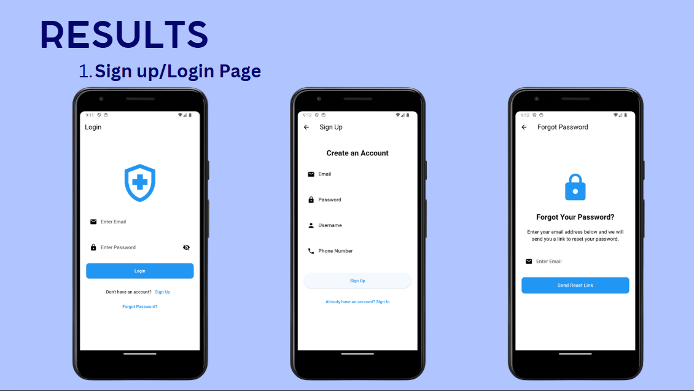
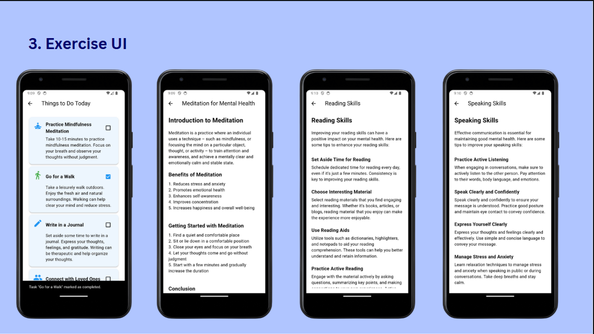

# 🌿 ZenithMind – AI-Powered Mental Health & Wellness App

**ZenithMind** is an AI-driven mental health and medical support app designed to assist users with reliable information, emotional check-ins, and daily mental wellness exercises. The app features an intelligent medical chatbot backed by vector search, doctor discovery by specialty, and emergency contact access — all integrated into one intuitive platform.

---

## 🧠 Key Features

- 🤖 **Medical Chatbot** – Powered by Pinecone vector search with embedded medical and wellness books for accurate, semantic responses.
- 🧘 **Mental Wellness Exercises** – Includes daily tasks like journaling, reading, and speaking activities for improving emotional health.
- ⏰ **Emotion Check-In Notifications** – Timely prompts for users to log their feelings and track their mood patterns.
- 🧑‍⚕️ **Doctor Directory** – Search and browse doctors by specialty with detailed profiles and available contact options.
- 🚨 **Emergency Contact Access** – Instantly connect with verified emergency numbers for urgent help.
- 📱 **Cross-Platform Interface** – Built with Flutter for smooth user experience across devices.

---

## 🏗️ Tech Stack

| Area                  | Tools & Frameworks                        |
|-----------------------|-------------------------------------------|
| **Frontend**          | Flutter                                   |
| **Backend**           | Flask, Python                             |
| **AI / NLP**          | LLaMA, Hugging Face Transformers      |
| **Vector DB**         | Pinecone (with embedded medical books)    |
| **Notifications**     | Flutter Local Notifications               |
| **Storage**           | Firebase        |

---

## 🖼️ Screenshots

> - Home Page

> - Chatbot Interface

> - Chatbot Interface

> - Chatbot Interface

